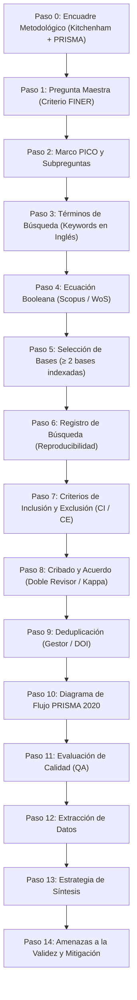

# 🗺️ Roadmap Metodológico para Revisión Sistemática de Literatura (RSL)

> **Basado en:** *Cómo redactar la sección Metodología de una Revisión Sistemática de Literatura (RSL) — Guía docente paso a paso*  
> **Autor original:** Mg. Jimmy Enrique Sánchez Portugal (Facultad de Ingeniería de Sistemas, Cómputo y Telecomunicaciones - UTP)  
> **Referencia local:** [Guía_Metodológica_RSL_QPHIJP.pdf](file:///c:/Users/HP/Desktop/ESCRITORIO/PROYECTOS%20UNIVERSIDAD/Formacion_Investigacion_42922/documents/Guía_Metodológica_RSL_QPHIJP.pdf)

---

## 🧭 Flujo Global y Mapa de Encadenamiento

Para garantizar una **trazabilidad total**, cada elemento metodológico debe alimentar al siguiente de forma continua y sin rupturas lógicas:

---

## 📌 Desglose Detallado de Pasos y Entregables

### [Paso 0] Encuadre Metodológico
* **Propósito:** Declarar formalmente bajo qué marcos normativos se conduce y reporta la investigación.
* **Marcos obligatorios:**
  * **Conducción:** Directrices de **Kitchenham & Charters** (para revisiones en ingeniería).
  * **Reporte:** Estándar **PRISMA 2020**.
* **Declaración clave:** El protocolo (preguntas, criterios, ecuaciones) debe haberse definido *a priori* (antes de realizar las consultas).
* **Evidencia requerida:** Documento o registro de protocolo fechado con anterioridad a la primera búsqueda (ej. registro en OSF o repositorio institucional con identificador).
* **Errores frecuentes:** Citar solo PRISMA u omitir Kitchenham; no declarar el registro previo del protocolo.

---

### [Paso 1] Pregunta Maestra (Research Question Principal)
* **Propósito:** Definir el núcleo de la revisión. Debe responderse sintetizando la literatura existente, **no con un experimento propio**.
* **Criterio FINER:**
  * **F**actible (respondible con la literatura indexada).
  * **I**nteresante.
  * **N**ovedosa (sin una RSL idéntica publicada).
  * **É**tica.
  * **R**elevante para la disciplina.
* **Plantilla redactable:**
  > *¿Cómo / En qué medida [Intervención: método/tecnología] influye en / afecta a [Outcome: propiedad medible] en [Población/Problema: contexto], en comparación con [Comparación: alternativa]?*
* **Evidencia requerida:** Enunciado de la pregunta aprobado + captura de búsqueda preliminar demostrando originalidad y ausencia de una RSL idéntica.

---

### [Paso 2] Marco PICO y Subpreguntas
* **Propósito:** Descomponer la pregunta maestra en elementos buscables y generar las subpreguntas que estructurarán los Resultados.
* **Componentes PICO:**
  * **P (Población / Problema):** Contexto o fenómeno investigado.
  * **I (Intervención):** Herramienta, técnica o tecnología evaluada.
  * **C (Comparación):** Alternativa frente a la cual se compara (puede omitirse con debida justificación).
  * **O (Outcome / Resultado):** Propiedad que se mide u observa.
* **Diagnóstico de idoneidad:**
  * Si los verbos son *comparar, evaluar, medir, optimizar* $\rightarrow$ Corresponde **PICO**.
  * Si los verbos son *mapear, identificar qué existe, caracterizar* $\rightarrow$ Corresponde **PCC / Scoping Review**.
* **Subpreguntas:** Formular como mínimo 2 subpreguntas secundarias (lo idóneo es una subpregunta por cada componente del marco).
* **Evidencia requerida:** Tabla de componentes PICO y tabla de trazabilidad de subpreguntas integradas en el documento.

---

### [Paso 3] Términos de Búsqueda Derivados de PICO
* **Propósito:** Derivar sistemáticamente las palabras clave a partir de cada casilla del PICO.
* **Regla indispensable:** Todos los términos, operadores y sinónimos deben estar en **inglés** (idioma estándar de indexación científica internacional).
* **Estructura:** Por cada casilla PICO, identificar el término base y conectar sus variantes/sinónimos mediante el operador `OR`.
* **Evidencia requerida:** Matriz de trazabilidad: `Componente PICO` $\rightarrow$ `Término base` $\rightarrow$ `Keywords y sinónimos en inglés efectivamente usados`.

---

### [Paso 4] Ecuación de Búsqueda
* **Propósito:** Diseñar la sintaxis lógica reproducible para los motores de búsqueda.
* **Estructura booleana:** Unir los bloques PICO con `AND` y los sinónimos internos con `OR`.
  $$\text{(Bloque P)} \;\mathbf{AND}\; \text{(Bloque I)} \;\mathbf{AND}\; \text{(Bloque C)} \;\mathbf{AND}\; \text{(Bloque O)}$$
  *(Se exige un mínimo de 3 operadores booleanos).*
* **Adaptación sintáctica:**
  * **Scopus:** `TITLE-ABS-KEY(...)`
  * **Web of Science:** `TS=(...)`
* **Evidencia requerida:** Transcripción literal y textual de la ecuación ejecutada tal como se pegó en el buscador.

---

### [Paso 5] Selección y Justificación de Bases de Datos
* **Propósito:** Asegurar cobertura exhaustiva y calidad académica de la literatura recuperada.
* **Requisito mínimo:** Consultar al menos **dos (2) bases de datos independientes indexadas y revisadas por pares** (ej. Scopus y Web of Science).
* **Advertencia:** No emplear *Google Scholar* como fuente principal (carece de control de indexación estricto y mezcla literatura gris no validada).
* **Evidencia requerida:** Nombres de las bases, justificación de su cobertura y vía institucional de acceso.

---

### [Paso 6] Registro de Búsqueda (Tabla de Reproducibilidad)
* **Propósito:** Permitir la replicación exacta de los resultados conforme al estándar PRISMA 2020.
* **Columnas obligatorias:**
  | Base de Datos | Fecha de Ejecución | Ecuación Aplicada | Resultados Brutos | Tras Filtros Preliminares |
  | :--- | :--- | :--- | :--- | :--- |
* **Evidencia requerida:** Capturas de pantalla fechadas con el número de resultados visible + archivo exportado de registros (`.ris` / `.bib`).

---

### [Paso 7] Criterios de Inclusión y Exclusión (CI / CE)
* **Propósito:** Establecer reglas operativas y objetivas para definir la elegibilidad de los artículos.
* **Ejes obligatorios a cubrir:**
  1. **Rango temporal:** Ventana de años justificada (ej. 2020–2026).
  2. **Idioma:** Idiomas admitidos (ej. inglés y español).
  3. **Tipo de documento:** Artículos de revista revisados por pares o conferencias indexadas.
  4. **Relevancia temática:** Alineación estricta con los componentes PICO.
* **Formato:** Codificados como `CI1`, `CI2`... y `CE1`, `CE2`...
* **Evidencia requerida:** Tabla de criterios codificados redactada antes de iniciar el cribado.

---

### [Paso 8] Cribado y Acuerdo Entre Revisores
* **Propósito:** Eliminar sesgos de selección individual.
* **Estándar:** Cribado ejecutado por **dos revisores independientes** (doble ciego o trabajo paralelo).
* **Resolución de discrepancias:** Por consenso argumentado o mediante intervención de un tercer revisor.
* **Métrica de concordancia:** Índice **Kappa de Cohen** ($\kappa > 0.80$ casi perfecto; $0.61 - 0.80$ sustancial).
* **Evidencia requerida:** Hoja de registro con las decisiones independientes de cada revisor y el valor de Kappa o bitácora de resolución de discrepancias.

---

### [Paso 9] Método de Deduplicación
* **Propósito:** Documentar la eliminación precisa de artículos repetidos entre las diferentes bases consultadas.
* **Identificador universal:** Cotejo prioritario a través del identificador **DOI**.
* **Herramientas:** Gestor de referencias bibliográficas (Mendeley, Zotero).
* **Evidencia requerida:** Reporte exportado de duplicados detectados y eliminados.

---

### [Paso 10] Diagrama de Flujo PRISMA 2020
* **Propósito:** Esquematizar cuantitativamente el embudo de filtrado de estudios en 4 fases:
  1. **Identificación:** Registros totales en bases $-$ Duplicados eliminados.
  2. **Cribado (Screening):** Registros revisados por título/resumen $-$ Registros excluidos / no recuperados.
  3. **Elegibilidad:** Textos completos evaluados $-$ Excluidos con desglose de motivos.
  4. **Inclusión:** Estudios definitivos que integran la RSL.
* **Regla matemática fundamental:** Cada cifra debe cuadrar con exactitud entre fases. Las exclusiones en elegibilidad deben tener motivos concretos y cuantificados (ej. *"fuera de rango temporal (n=3), sin DOI (n=2), enfoque no pertinente (n=5)"*).
* **Evidencia requerida:** Diagrama PRISMA completo y lista nominal de artículos descartados en elegibilidad con su DOI y causa de exclusión.

---

### [Paso 11] Evaluación de Calidad (Quality Assessment - QA)
* **Propósito:** Determinar el rigor metodológico de los artículos incluidos antes de procesar sus hallazgos.
* **Estructura del instrumento:**
  * Definir 5 preguntas de calidad metodológica (QA1 a QA5).
  * Escala cuantitativa: `Sí = 1`, `Parcial = 0.5`, `No = 0` (puntuación máxima: 5 pts).
  * Definir umbral de aceptación (ej. $\ge 2.5$ pts para ser admitido).
* **Evidencia requerida:** Matriz completa de puntuación de QA para la totalidad de estudios incluidos.

---

### [Paso 12] Extracción de Datos
* **Propósito:** Recopilar de forma estructurada las evidencias empíricas requeridas para responder a las subpreguntas PICO.
* **Campos del formulario de extracción:**
  * Identificador / Referencia (`[S1]`, `[S2]`, etc.)
  * Autor(es) y Año
  * Diseño del estudio (caso de estudio, experimento, cuasiexperimento, etc.)
  * Intervención / Método / Framework analizado
  * Métricas y resultados reportados
  * Subpregunta PICO a la que tributa
* **Evidencia requerida:** Formulario de extracción de datos completamente diligenciado.

---

### [Paso 13] Estrategia de Síntesis
* **Propósito:** Fundamentar la metodología empleada para agregar e interpretar los resultados.
* **Justificación metodológica:** Si los estudios presentan heterogeneidad en métodos, contextos o métricas, se debe justificar la adopción de una **síntesis narrativa temática** organizada por subpreguntas de investigación, en lugar de un metaanálisis cuantitativo.
* **Evidencia requerida:** Declaración explícita de la estrategia y tabla de categorización temática.

---

### [Paso 14] Amenazas a la Validez y Mitigación
* **Propósito:** Reconocer con rigor científico las limitaciones inherentes al diseño de la revisión y cómo fueron controladas.
* **Amenazas estándar y mitigaciones:**
  * **Sesgo de selección:** Mitigado por la consulta a bases indexadas de alto impacto (Scopus/WoS) y criterios de elegibilidad transparentes.
  * **Sesgo de publicación:** Reconocer que solo se capturó literatura formalmente publicada.
  * **Sesgo del evaluador:** Mitigado mediante la participación de doble revisor y validación por consenso.
  * **Validez de constructo:** Mitigada mediante la rigurosa derivación de descriptores desde el marco PICO y sinónimos en inglés.
* **Evidencia requerida:** Sección redactada de amenazas a la validez con su correspondiente tabla de mitigación.

---

## 📋 Checklist de Control para Entrega

Marque cada casilla únicamente tras verificar el cumplimiento completo:

- [ ] **Paso 0:** Se citó a Kitchenham & Charters y PRISMA 2020, declarando el registro previo del protocolo.
- [ ] **Paso 1:** La pregunta maestra cumple el criterio FINER y se responde mediante síntesis documental.
- [ ] **Paso 2:** Se incluyó la tabla PICO y las subpreguntas derivan directamente de sus componentes.
- [ ] **Paso 3:** Los términos de búsqueda provienen de PICO y están íntegramente en inglés con sinónimos.
- [ ] **Paso 4:** La ecuación de búsqueda posee $\ge 3$ operadores booleanos y está adaptada a Scopus y WoS.
- [ ] **Paso 5:** Se consultaron e individualizaron al menos 2 bases de datos científicas indexadas.
- [ ] **Paso 6:** Se incluyó la tabla de reproducibilidad con fechas exactas y conteos por base.
- [ ] **Paso 7:** Los criterios CI/CE están codificados y cubren temporalidad, idioma, tipo y temática.
- [ ] **Paso 8:** Se describió el proceso de doble revisor y el mecanismo de resolución de discrepancias.
- [ ] **Paso 9:** Se detalló el procedimiento de deduplicación mediante DOI en gestor bibliográfico.
- [ ] **Paso 10:** El diagrama PRISMA presenta coherencia aritmética exacta en todas sus fases.
- [ ] **Paso 11:** Se aplicó la evaluación de calidad (QA) con escala cuantitativa y umbral de corte.
- [ ] **Paso 12:** El formulario de extracción mapea cada estudio con sus respectivas subpreguntas.
- [ ] **Paso 13:** Se justificó formalmente la estrategia de síntesis narrativa temática.
- [ ] **Paso 14:** Se declararon las 4 amenazas metodológicas a la validez y sus vías de mitigación.
- [ ] **Carpeta de Evidencias:** Se cuenta con las capturas de pantalla, archivos `.bib`/`.ris` y matrices de cálculo archivadas.

> **Nota de integridad académica:** Ninguna evidencia debe fabricarse o alterarse. Es preferible declarar con honestidad una limitación del estudio antes que presentar datos o registros no fidedignos (*Código de Ética del Investigador UTP*).
