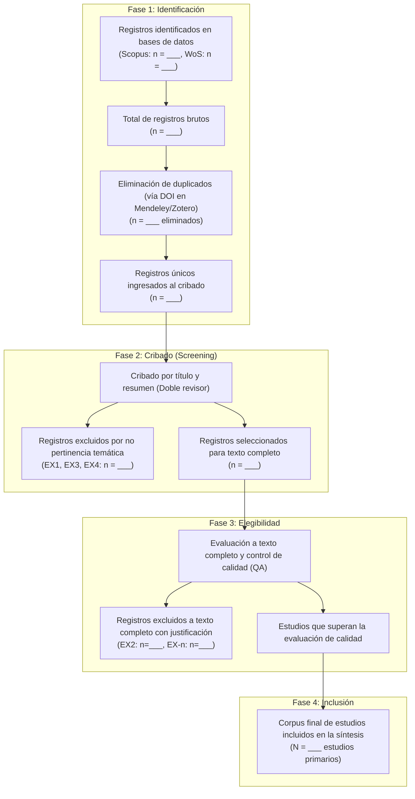

# Metodología de la Revisión Sistemática de Literatura (RSL)

## 0. Encuadre metodológico y estándares de investigación

La presente Revisión Sistemática de Literatura (RSL) se diseña y ejecuta bajo las directrices metodológicas de **Kitchenham & Charters (2007)** para la ingeniería de software y sistemas de información, y se reporta siguiendo los estándares internacionales de la declaración **PRISMA 2020** (_Preferred Reporting Items for Systematic Reviews and Meta-Analyses_).

El protocolo de investigación (preguntas, criterios de elegibilidad, ecuaciones de búsqueda y estrategia de extracción) ha sido formalizado _a priori_ para garantizar la objetividad, la reproducibilidad y la mitigación de sesgos en la selección del corpus documental.

---

## 1. Paso 1 — El tema de partida y delimitación del estudio

El estudio aborda el uso de la **Inteligencia Artificial (IA)** y el **Procesamiento Inteligente de Documentos (IDP / Intelligent Document Processing)** en la automatización del registro y la validación de documentos empresariales.

- **Delimitación positiva:** Sistemas de información empresariales (ERP, CRM, gestores documentales) y flujos internos de registro y validación documental corporativos estrictamente privados.
- **Delimitación negativa:** Se excluyen los sistemas de administración pública/gubernamental, los servicios de atención ciudadana y los flujos documentales masivos de cara al usuario final externo, debido a que obedecen a marcos regulatorios, volumetrías y dinámicas operativas distintas.

---

## 2. Paso 2 — Delimitación de los componentes PICOC

Para descomponer el problema y asegurar una cobertura exhaustiva y auditable, se emplea el marco extendido **PICOC** (Población, Intervención, Comparación, Outcome/Resultado y Contexto):

| Componente                   | Definición para este estudio                                                                                                                | Justificación                                                                                                                            |
| :--------------------------- | :------------------------------------------------------------------------------------------------------------------------------------------ | :--------------------------------------------------------------------------------------------------------------------------------------- |
| **P — Población / Problema** | Sistemas de información empresariales (ERP, CRM, DMS) y flujos internos de registro y validación documental.                                | Representa el entorno operativo y tecnológico donde se generan cuellos de botella por el ingreso manual y la heterogeneidad de formatos. |
| **I — Intervención**         | Arquitecturas de Inteligencia Artificial para IDP (IA-OCR, KIE, modelos basados en secuencias, grafos o LLM multimodales).                  | Constituye la tecnología y enfoque algorítmico cuyo impacto y eficacia se analizan en la literatura.                                     |
| **C — Comparación**          | Ingreso manual de datos o procesamiento tradicional basado en reglas y plantillas rígidas.                                                  | Establece la línea base convencional frente a la cual se contrasta la ganancia en precisión, tiempo y costos.                            |
| **O — Resultado / Outcome**  | Grado de automatización, reducción de la carga operativa, precisión en la extracción (F1-score, exactitud) y velocidad/tiempo de respuesta. | Variables cuantitativas y métricas de rendimiento clave para evaluar la viabilidad y el retorno operativo.                               |
| **C — Contexto**             | Entornos corporativos privados y ventana temporal 2018–2025.                                                                                | Delimita el dominio de aplicación y el período de maduración de los modelos de aprendizaje profundo y multimodales.                      |

---

## 3. Paso 3 — La pregunta maestra

Articulando los cinco componentes del marco PICOC en una única formulación integral, la pregunta principal de la investigación se define como:

> **¿Cuál es el impacto de las arquitecturas de Inteligencia Artificial y Procesamiento Inteligente de Documentos (IDP), frente al ingreso manual y enfoques basados en reglas, sobre la precisión, la velocidad y la reducción de la carga operativa en el registro y validación documental dentro de sistemas empresariales, entre 2018 y 2025?**

---

## 4. Paso 4 — Descomposición en preguntas de investigación (PI)

A partir del andamiaje PICOC, la pregunta maestra se descompone en **cuatro Preguntas de Investigación (PI)** temáticas que orientan la extracción y síntesis de evidencia técnica:

| Código  | Pregunta de investigación                                                                                                                                                        | Componente PICOC que la origina |
| :------ | :------------------------------------------------------------------------------------------------------------------------------------------------------------------------------- | :-----------------------------: |
| **PI1** | ¿Qué arquitecturas y enfoques algorítmicos de IA/IDP (secuencias, grafos, modelos generativos multimodales) se han implementado en el procesamiento de documentos empresariales? |              **I**              |
| **PI2** | ¿Qué niveles de precisión (F1-score, exactitud) y velocidad/tiempo de resolución alcanzan estas arquitecturas en tareas de extracción de datos semiestructurados?                |            **I + O**            |
| **PI3** | ¿Qué diferencias de desempeño, escalabilidad y costo operativo se reportan entre las soluciones basadas en IA y los métodos tradicionales o manuales?                            |           **I vs. C**           |
| **PI4** | ¿En qué tipologías documentales (facturas, recibos, formularios, contratos) y arquitecturas de sistemas empresariales (ERP/CRM) se han validado estas propuestas?                |        **P / Contexto**         |

---

## 5. Paso 5 — Preguntas descriptivas o bibliométricas (PD)

Para caracterizar cuantitativamente el cuerpo de literatura científica recuperado, se formulan **tres Preguntas Descriptivas (PD)** independientes del análisis temático PICO:

| Código  | Pregunta descriptiva / bibliométrica                                                                                                                   | Propósito en la RSL                                                                                 |
| :------ | :----------------------------------------------------------------------------------------------------------------------------------------------------- | :-------------------------------------------------------------------------------------------------- |
| **PD1** | ¿Cómo ha evolucionado el volumen de producción científica anual sobre IA aplicada a documentos empresariales entre 2018 y 2025?                        | Identificar tendencias de publicación y puntos de inflexión temporal en el área.                    |
| **PD2** | ¿Qué autores, revistas/conferencias indexadas y países concentran la mayor productividad e impacto académico?                                          | Mapear los núcleos de investigación y los canales de difusión de mayor relevancia.                  |
| **PD3** | ¿Qué tipos de diseño metodológico (estudios de caso, experimentos controlados, benchmarks) y datasets (públicos vs. privados) predominan en el corpus? | Evaluar el nivel de madurez empírica y la transferibilidad de las soluciones al entorno industrial. |

---

## 6. Paso 6 — Términos de búsqueda y ecuación lógica

A partir de los componentes PICOC, se derivaron los términos clave y sinónimos en inglés, combinándolos con el operador booleano `OR` dentro de cada bloque, aplicando comodines (`*`) para capturar variaciones morfológicas y uniendo los bloques con el operador `AND`.

### 6.1. Matriz de descriptores y palabras clave (actualizada)

| Bloque PICOC | Concepto base                                         | Descriptores en inglés (con sinónimos, variantes y comodines)                                                                                                                                                                               |
| :----------: | :---------------------------------------------------- | :------------------------------------------------------------------------------------------------------------------------------------------------------------------------------------------------------------------------------------------ |
|    **P**     | Sistemas empresariales y documentos                   | `"business document*"` OR `"financial document*"` OR `"administrative document*"` OR `"invoice*"` OR `"receipt*"` OR `"document management"` OR `"business workflow*"` OR `"ERP"` OR `"enterprise system*"`                                 |
|    **I**     | Inteligencia Artificial y Procesamiento de Documentos | `"intelligent document processing"` OR `"IDP"` OR `"document AI"` OR `"document understanding"` OR `"key information extraction"` OR `"KIE"` OR `"LayoutLM*"` OR `"optical character recognition"` OR `"OCR"` OR `"information extraction"` |
|  **O / C**   | Automatización, validación y desempeño                | `"automat*"` OR `"validat*"` OR `"extract*"` OR `"recognition"` OR `"accuracy"` OR `"efficiency"` OR `"workload"`                                                                                                                           |

### 6.2. Ecuación booleana principal calibrada

```text
("business document*" OR "financial document*" OR "administrative document*" OR "invoice*" OR "receipt*" OR "document management" OR "business workflow*" OR "ERP" OR "enterprise system*")
AND ("intelligent document processing" OR "IDP" OR "document AI" OR "document understanding" OR "key information extraction" OR "KIE" OR "LayoutLM*" OR "optical character recognition" OR "OCR" OR "information extraction")
AND ("automat*" OR "validat*" OR "extract*" OR "recognition" OR "accuracy" OR "efficiency" OR "workload")
```

### 6.3. Adaptación sintáctica por base de datos

- **Scopus:**
  ```text
  TITLE-ABS-KEY(("business document*" OR "financial document*" OR "administrative document*" OR "invoice*" OR "receipt*" OR "document management" OR "business workflow*" OR "ERP" OR "enterprise system*") AND ("intelligent document processing" OR "IDP" OR "document AI" OR "document understanding" OR "key information extraction" OR "KIE" OR "LayoutLM*" OR "optical character recognition" OR "OCR" OR "information extraction") AND ("automat*" OR "validat*" OR "extract*" OR "recognition" OR "accuracy" OR "efficiency" OR "workload"))
  ```
- **Web of Science (WoS):**
  ```text
  TS=(("business document*" OR "financial document*" OR "administrative document*" OR "invoice*" OR "receipt*" OR "document management" OR "business workflow*" OR "ERP" OR "enterprise system*") AND ("intelligent document processing" OR "IDP" OR "document AI" OR "document understanding" OR "key information extraction" OR "KIE" OR "LayoutLM*" OR "optical character recognition" OR "OCR" OR "information extraction") AND ("automat*" OR "validat*" OR "extract*" OR "recognition" OR "accuracy" OR "efficiency" OR "workload"))
  ```

### 6.4. Registro de ecuaciones ejecutadas por iteración (Trazabilidad detallada)

Para preservar el registro exacto de cada consulta realizada sin saturar las tablas sinópticas, se codifican a continuación las cadenas booleanas ejecutadas:

#### **[EQ-IT1] Ecuación de la Iteración 1 (Exploratoria / Restrictiva — Scopus)**

```text
TITLE-ABS-KEY(("enterprise information systems" OR "document management" OR "business workflows" OR "ERP" OR "invoice processing" OR "receipt processing") AND ("intelligent document processing" OR "IDP" OR "optical character recognition" OR "OCR" OR "information extraction" OR "key information extraction" OR "document AI" OR "LayoutLM") AND ("manual data entry" OR "manual processing" OR "traditional processing" OR "rule-based" OR "automation" OR "workload reduction" OR "efficiency" OR "accuracy"))
```

#### **[EQ-IT2-SCOPUS] Ecuación de la Iteración 2 (Calibrada Definitiva — Scopus)**

```text
TITLE-ABS-KEY(("business document*" OR "financial document*" OR "administrative document*" OR "invoice*" OR "receipt*" OR "document management" OR "business workflow*" OR "ERP" OR "enterprise system*") AND ("intelligent document processing" OR "IDP" OR "document AI" OR "document understanding" OR "key information extraction" OR "KIE" OR "LayoutLM*" OR "optical character recognition" OR "OCR" OR "information extraction") AND ("automat*" OR "validat*" OR "extract*" OR "recognition" OR "accuracy" OR "efficiency" OR "workload"))
```

#### **[EQ-IT2-WOS] Ecuación de la Iteración 2 (Calibrada Definitiva — Web of Science)**

```text
TS=(("business document*" OR "financial document*" OR "administrative document*" OR "invoice*" OR "receipt*" OR "document management" OR "business workflow*" OR "ERP" OR "enterprise system*") AND ("intelligent document processing" OR "IDP" OR "document AI" OR "document understanding" OR "key information extraction" OR "KIE" OR "LayoutLM*" OR "optical character recognition" OR "OCR" OR "information extraction") AND ("automat*" OR "validat*" OR "extract*" OR "recognition" OR "accuracy" OR "efficiency" OR "workload"))
```

### 6.5. Tabla comparativa de iteraciones y calibración de la búsqueda


La siguiente tabla resume la evolución metodológica del proceso de consulta, referenciando las ecuaciones codificadas en la sección 6.4:

|  N.° Iteración  |   Base de datos    | Ecuación referenciada | Resultados brutos ($n$) | Diagnóstico metodológico                                                                                       |    Decisión    | Evidencia archivada                                        |
| :-------------: | :----------------: | :-------------------: | :---------------------: | :------------------------------------------------------------------------------------------------------------- | :------------: | :--------------------------------------------------------- |
| **Iteración 1** |     **Scopus**     |      `[EQ-IT1]`       |         **142**         | **Sobre-restringida:** Frases literales cerradas y comparación manual rígida que limitaron la recuperación.    | **Descartada** | `project/metodologia/evidencias/scopus_iteracion1_142.png` |
| **Iteración 2** |     **Scopus**     |   `[EQ-IT2-SCOPUS]`   |         **865**         | **Óptima:** Uso de comodines (`*`), descriptores _KIE/Doc AI_ y ampliación morfológica ($800 \le n \le 1200$). |  **Aprobada**  | `project/metodologia/evidencias/scopus_iteracion2_865.png` |
| **Iteración 2** | **Web of Science** |    `[EQ-IT2-WOS]`     |         **123**         | **Sobre-restringida:** El campo `TS` de WoS con la misma sintaxis de Scopus resultó mucho más restrictivo (razón ~1:7 frente a Scopus). | **Descartada** | `project/metodologia/evidencias/wos_iteracion_1_123.png`   |
| **Iteración 3** | **Web of Science** |    `[EQ-IT3-WOS]`     |         **755**         | **Óptima:** Ampliación del bloque de Intervención con sinónimos generales (_NLP, deep learning, machine learning_), orden de magnitud comparable a Scopus. | **Aprobada** | `project/metodologia/evidencias/wos_iteracion_2_755.png`   |

---
## 7. Paso 7 — Criterios de inclusión y exclusión codificados

Los criterios de elegibilidad se codifican de forma unívoca para permitir la trazabilidad individual de cada decisión de cribado.

> **Regla operativa de filtrado:** Primero se declaran los criterios de inclusión; durante el cribado, se aplican primero las exclusiones gruesas (año, idioma, tipo de documento) y posteriormente se verifica la inclusión temática a texto completo.

|  Código  |   Tipo    | Criterio de elegibilidad                                                                                                                                            |
| :------: | :-------: | :------------------------------------------------------------------------------------------------------------------------------------------------------------------ |
| **IN1**  | Inclusión | Estudios publicados en la ventana temporal comprendida entre **2018 y 2025**.                                                                                       |
| **IN2**  | Inclusión | Artículos de revista revisados por pares (_journal articles_) o ponencias en congresos internacionales indexados (_conference proceedings_).                        |
| **IN3**  | Inclusión | Estudios indexados en las bases de datos principales **Scopus** o **Web of Science Core Collection**.                                                               |
| **IN4**  | Inclusión | Artículos que propongan, evalúen o comparen modelos de IA/IDP aplicados al registro, extracción o validación de documentos en entornos empresariales.               |
| **EX1**  | Exclusión | Documentos publicados en idiomas distintos al **inglés** o **español**.                                                                                             |
| **EX2**  | Exclusión | Publicaciones no disponibles a texto completo a través de los accesos institucionales.                                                                              |
| **EX3**  | Exclusión | Literatura gris, preprints (arXiv sin revisión por pares), notas editoriales, resúmenes breves (_extended abstracts_) o capítulos de libros sin arbitraje estricto. |
| **EX4**  | Exclusión | Estudios enfocados exclusivamente en trámites del sector público/gubernamental o registros médicos no equiparables a flujos empresariales.                          |
| **EX-n** | Exclusión | Documentos que, tras la lectura completa, no aportan evidencia empírica a ninguna de las cuatro preguntas de investigación (**PI1–PI4**).                           |

---

## 8. Paso 8 — Bitácora de reducción del corpus (evidencia de búsqueda)

Para garantizar la **reproducibilidad temporal**, las búsquedas en todas las bases se ejecutan en la misma fecha calendario.

### 8.1. Registro maestro por base indexada

| Base de datos               |   Fecha de ejecución   | Ecuación adaptada                                   | Resultados brutos ($n$) | Tras filtros nativos ($n$) | Archivo exportado de evidencia                                                   |
| :-------------------------- | :--------------------: | :-------------------------------------------------- | :---------------------: | :------------------------: | :------------------------------------------------------------------------------- |
| **Scopus**                  | _[Fecha de ejecución]_ | Ecuación calibrada (Iteración 2) en `TITLE-ABS-KEY` |         **865**         | _[En proceso de filtrado]_ | `project/metodologia/evidencias/scopus_iteracion2_865.png` y `scopus_export.ris` |
| **Web of Science**          | _[Fecha de ejecución]_ | Ecuación calibrada (Iteración 3) en `TS`            |    **755**    |     **154**      | `project/metodologia/evidencias/wos_iteracion_2_755.png` y `wos_export.ris`     |
| **Total bruto consolidado** |           —            | —                                                   |     **1620**     |     **$N_{nativos}$**      | —                                                                                |
 
 

### 8.2. Bitácora de filtros nativos paso a paso (Scopus)

| Base       | Filtro nativo aplicado                   | Valor del filtro                                 |  $n$ restante  | Evidencia asociada                                  |
| :--------- | :--------------------------------------- | :----------------------------------------------- | :------------: | :-------------------------------------------------- |
| **Scopus** | _(Búsqueda inicial bruta - Iteración 2)_ | Ecuación calibrada sin filtros                   |    **865**     | `assets/metodologia/scopus_iteracion2_865.png`      |
| Scopus     | 1. Rango temporal                        | 2018–2025                                        | _[Por anotar]_ | Captura fechada tras filtro de años                 |
| Scopus     | 2. Tipo de documento                     | Article, Conference Paper                        | _[Por anotar]_ | Captura tras filtro de tipo de documento            |
| Scopus     | 3. Idioma                                | English, Spanish                                 | _[Por anotar]_ | Captura tras filtro de idioma                       |
| Scopus     | 4. Área temática                         | Computer Science, Engineering, Decision Sciences | _[Por anotar]_ | `assets/metodologia/scopus_filtros_paso_a_paso.png` |

### 8.3. Bitácora de filtros nativos paso a paso (Web of Science)


| Base    | Filtro nativo aplicado                                                                                                                                                                | Valor del filtro     | $n$ restante | Evidencia asociada                                            |
| :------ | :------------------------------------------------------------------------------------------------------------------------------------------------------------------------------------ | :-------------------- | :----------: | :-------------------------------------------------------------- |
| **WoS** | _(Búsqueda inicial bruta — Iteración 3)_                                                                                                                                               | Ecuación calibrada sin filtros | **755** | `project/metodologia/evidencias/wos_iteracion_2_755.png`        |
| WoS     | 1–3. Tipo de documento (Artículo) + Idioma (Inglés) + Rango temporal (2018–2025, implícito en el corpus resultante)                                                                   | Filtros acumulados    |   **154**    | `project/metodologia/evidencias/wos_refine_154.xlsx`             |
| WoS     | 4. Categoría WoS                                                                                                                                                                        | Engineering Electrical Electronic, Computer Science Information Systems, Telecommunications, Computer Science Artificial Intelligence, Computer Science Interdisciplinary Applications, Computer Science Theory Methods, Computer Science Hardware Architecture, Operations Research Management Science, Computer Science Software Engineering | **154** | `project/metodologia/evidencias/wos_filtros_paso_a_paso.png`   |

---
 

## 9. Paso 9 — Las cuatro fases del flujo PRISMA 2020

El proceso de selección se estructura en cuatro fases rigurosamente secuenciales:



### Protocolo de cribado y control de sesgos:

1. **Deduplicación:** Se realiza mediante cotejo automático y manual de **DOI** y títulos normalizados en gestor bibliográfico (**Mendeley / Zotero**).
2. **Cribado por doble revisor:** Dos investigadores revisan independientemente los títulos y resúmenes. Las discrepancias se resuelven por consenso argumentado o con arbitraje de un tercer revisor, reportando el nivel de concordancia mediante el **índice Kappa de Cohen** ($\kappa$).
3. **Evaluación de Calidad Metodológica (QA):** Se aplica una escala basada en Kitchenham con 5 preguntas de control (`QA1` a `QA5`) calificadas como `1 = Sí`, `0.5 = Parcial`, `0 = No`, estableciendo un umbral mínimo de corte ($\ge 3.0/5.0$) para la inclusión definitiva.

---

## 10. Paso 10 — Tabla de mapeo artículo × pregunta y alerta de ineditud

### 10.1. Matriz de trazabilidad (Artículo × PI)

Cada artículo del corpus final se valida contra las cuatro preguntas de investigación temáticas para clasificar los aportes y verificar que no existan estudios desconectados:

| Código de estudio | Referencia bibliográfica | PI1 (Arquitecturas) | PI2 (Métricas/Velocidad) | PI3 (Comparación vs Trad.) | PI4 (Tipologías/ERP) | Total preguntas | Clasificación del estudio   |
| :---------------: | :----------------------- | :-----------------: | :----------------------: | :------------------------: | :------------------: | :-------------: | :-------------------------- |
|     **[S01]**     | _Autor et al., Año_      |          ✔          |            ✔             |             ✔              |          ✔           |       4/4       | **Estudio nuclear**         |
|     **[S02]**     | _Autor et al., Año_      |          ✔          |            ✔             |             —              |          ✔           |       3/4       | Estudio de soporte temático |
|     **[S03]**     | _Autor et al., Año_      |          ✔          |            —             |             —              |          ✔           |       2/4       | Estudio de caracterización  |
|     **[...]**     | _..._                    |         ...         |           ...            |            ...             |         ...          |       ...       | ...                         |

- **Estudios Nucleares (4/4):** Artículos que abordan simultáneamente arquitectura, métricas, comparativa y contexto empresarial; constituyen la columna vertebral de la discusión.
- **Alerta de exclusión (0/4):** Todo artículo que tras la lectura completa no marque ninguna casilla queda excluido automáticamente bajo la causal **`EX-n`**.

### 10.2. Paso 10-bis: Protocolo ante la Alerta de Ineditud

Si durante el cribado se detecta un artículo que responde íntegramente a las 4 preguntas de investigación:

1. **Si es un estudio primario:** Se valida como _estudio nuclear_.
2. **Si es una revisión sistemática previa (RSL o Survey):** Se activa la **alerta de ineditud**. Se analiza su ventana temporal y taxonomía para diferenciar formalmente la presente RSL como un avance que cubre una brecha no resuelta (ej. incorporación de modelos multimodales recientes post-2023 o foco específico en ERP corporativos).

---

## 11. Paso 11 — Enlace de cada pregunta con la sección de Resultados

Para garantizar la coherencia estricta de la RSL, **cada pregunta (PI y PD) se responde de manera explícita en la sección de Resultados** con sustento cuantitativo, tabla y gráfico propios:

| Pregunta | Contenido temático a responder en Resultados                                        | Tabla de evidencia asociada                                                                 | Gráfico cuantitativo asociado                                                 |
| :------: | :---------------------------------------------------------------------------------- | :------------------------------------------------------------------------------------------ | :---------------------------------------------------------------------------- |
| **PD1**  | Evolución temporal de publicaciones sobre IA/IDP en documentos empresariales.       | Tabla de distribución de frecuencia de artículos por año (2018–2025).                       | Gráfico de líneas / barras de tendencia temporal.                             |
| **PD2**  | Productividad académica por autor, revista/conferencia indexada y país de origen.   | Ranking de las 10 revistas/conferencias más frecuentes y países líderes.                    | Gráfico de barras horizontales / mapa coroplético de distribución geográfica. |
| **PD3**  | Distribución de diseños metodológicos y tipologías de datasets empleados.           | Tabla cruzada de diseño del estudio $\times$ tipo de dataset (público vs. empresarial).     | Gráfico circular o de barras apiladas por tipología de validación.            |
| **PI1**  | Taxonomía de enfoques algorítmicos (secuenciales, grafos, LLM multimodales/KIE).    | Matriz de arquitecturas de IA identificadas $\times$ número de estudios.                    | Gráfico de barras por familia algorítmica.                                    |
| **PI2**  | Rendimiento cuantitativo reportado (F1-score, exactitud, reducción de tiempo).      | Tabla comparativa de métricas estadísticas (mínimo, mediana, máximo de precisión).          | Diagrama de caja y bigotes (_boxplot_) o gráfico de dispersión de métricas.   |
| **PI3**  | Comparativa de eficiencia y costo operativo: IA/IDP frente a ingreso manual/reglas. | Tabla de ganancia porcentual en velocidad y tasa de reducción de error operativo.           | Gráfico de barras comparativas (Método tradicional vs. Enfoque IA).           |
| **PI4**  | Tipologías documentales (facturas, recibos, órdenes) y sistemas ERP/CRM integrados. | Tabla de frecuencia por tipo de documento visualmente rico $\times$ plataforma empresarial. | Gráfico de barras agrupadas o matriz de calor (_heatmap_).                    |

---

## 12. Cierre: Cadena de trazabilidad metodológica completa

El flujo metodológico consolidado asegura que cada artículo, cifra y resultado sea completamente auditable bajo la siguiente cadena:

$$\text{Tema} \longrightarrow \text{PICOC} \longrightarrow \text{Pregunta Maestra} \longrightarrow \text{Preguntas (PI + PD)} \longrightarrow \text{Ecuación Booleana} \longrightarrow \text{Criterios IN/EX} \longrightarrow \text{Bitácora de Filtros} \longrightarrow \text{Flujo PRISMA} \longrightarrow \text{Mapeo Artículos} \longrightarrow \text{Resultados (Tablas + Gráficos)}$$
