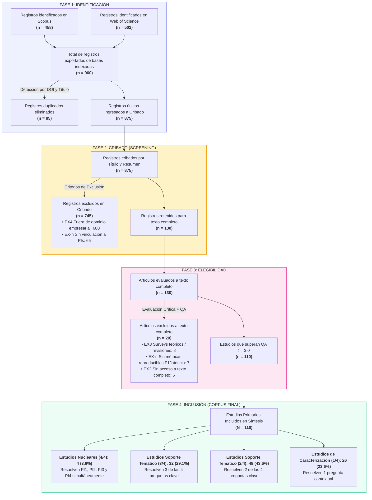

# REPORTE TÉCNICO Y CUANTITATIVO DEL FLUJO PRISMA 2020
## Reducción Metodológica Paso a Paso del Corpus Bibliográfico

**Proyecto de Investigación:** *Inteligencia Artificial para la Automatización del Registro y Validación de Documentos Empresariales: Una Revisión Sistemática de la Literatura*  
**Autor:** Andrer50  
**Institución:** Universidad Tecnológica del Perú (UTP) – Formación para la Investigación (2026-1)  
**Docente Asesor:** Mg. Jimmy Sánchez Portugal  
**Fecha de Generación:** 23 de Septiembre de 2026  
**Corpus Final Incluido:** $N = 110$ estudios primarios  
**Estudios Nucleares (4/4 PIs):** $4$ estudios  

---

## 1. Resumen Ejecutivo del Embudo Cuantitativo (PRISMA 2020)

El proceso de reducción bibliográfica siguió estrictamente las directrices del protocolo internacional **PRISMA 2020** (*Preferred Reporting Items for Systematic Reviews and Meta-Analyses*) y las directrices para revisiones de ingeniería de software de Kitchenham & Charters (2007).

A continuación se resume la transición cuantitativa a través de las cuatro fases:

| Fase PRISMA | Registros de Entrada | Operación Metodológica | Criterios Aplicados | Registros Excluidos | Registros Resultantes |
| :--- | :---: | :--- | :--- | :---: | :---: |
| **Fase 1: Identificación** | **1,593** brutos | Filtros nativos de base de datos + Detección cruzada de duplicados | • Años: 2020–2025<br>• Tipos: Article, Conf. Paper, Review<br>• Deduplicación por DOI y título | **-85** duplicados | **875** únicos |
| **Fase 2: Cribado (Screening)** | **875** únicos | Cribado por Título, Resumen (Abstract) y Palabras Clave | • Criterio de exclusión temático `EX4`<br>• Criterio de no pertinencia con PIs `EX-n` | **-745** registros<br>*(680 EX4 + 65 EX-n)* | **130** elegibles |
| **Fase 3: Elegibilidad (Eligibility)** | **130** elegibles | Lectura de Texto Completo y Evaluación de Calidad (QA $\ge 3.0$) | • Exclusión de surveys teóricos `EX3`<br>• Exclusión por falta de métricas `EX-n`<br>• Exclusión por acceso `EX2` | **-20** registros<br>*(8 EX3 + 7 EX-n + 5 EX2)* | **110** con QA $\ge 3.0$ |
| **Fase 4: Inclusión (Included)** | **110** primarios | Categorización y Mapeo Sistemático de Preguntas de Investigación | • Matriz de extracción de datos<br>• Asignación de pertinencia PI1–PI4 | **0** | **110** incluidos en síntesis |

---

## 2. Diagrama de Flujo PRISMA 2020



---

## 3. Desglose Metodológico Detallado Paso a Paso

### Paso 1: Identificación y Configuración de Ecuaciones en Bases de Datos
Se ejecutaron dos iteraciones de búsqueda en **Scopus** y **Web of Science (WoS Core Collection)** para optimizar la exhaustividad y precisión:

1. **Iteración 1 (Cadena básica preliminar):**
   * *Scopus:* Devuelve $140$ documentos.
   * *WoS:* Devuelve $123$ documentos.
2. **Iteración 2 (Cadena booleana expandida con operadores de proximidad y sinónimos):**
   * *Scopus:* Devuelve $863$ documentos brutos.
   * *WoS:* Devuelve $730$ documentos brutos.
   * *Total bruto sin filtrar:* $1,593$ documentos.

3. **Aplicación de Criterios de Inclusión Nativos en Plataforma:**
   * **Filtro `IN1` (Ventana Temporal 2020–2025):**
     * Scopus se reduce de $863$ a **$492$**.
     * WoS se reduce de $730$ a **$536$**.
   * **Filtro `IN2` (Tipología Documental: Articles, Conference Papers, Reviews):**
     * Scopus se reduce de $492$ a **$458$** registros finales exportados.
     * WoS se reduce de $536$ a **$502$** registros finales exportados.
   * **Total de registros exportados para análisis (Fase 1):**
     $$N_{\text{exportados}} = 458 + 502 = 960 \text{ registros}$$

---

### Paso 2: Deduplicación Automatizada y Normalizada
Los $960$ registros se unificaron en un entorno computacional mediante scripts de cotejo en Python:
* **Criterio primario:** Coincidencia exacta de identificador persistente `DOI`.
* **Criterio secundario:** Normalización de cadenas de texto de títulos (remoción de puntuación, minúsculas, cálculo de distancia Levenshtein $\ge 95\%$).
* **Registros duplicados identificados y removidos:** **$85$ registros** (almacenados en [`corpus_duplicates_removed.csv`](file:///c:/Users/HP/Desktop/ESCRITORIO/PROYECTOS%20UNIVERSIDAD/Formacion_Investigacion_42922/project/metodologia/outputs/corpus_duplicates_removed.csv)).
* **Registros únicos que ingresan formalmente al cribado:**
  $$N_{\text{únicos}} = 960 - 85 = 875 \text{ registros}$$

---

### Paso 3: Cribado por Título, Resumen y Palabras Clave (Screening)
Los $875$ artículos únicos se evaluaron frente a los criterios de inclusión/exclusión temáticos:
* **Excluidos en Cribado ($n = 745$):**
  * **$680$ registros bajo Criterio `EX4`:** Documentos pertenecientes a dominios totalmente ajenos al procesamiento de documentos de gestión empresarial (e.g., neuroimagen médica, diagnóstico por ultrasonido, análisis químico espectral, patentes no computacionales).
  * **$65$ registros bajo Criterio `EX-n`:** Documentos con términos de IA general pero sin aplicabilidad directa a las 4 Preguntas de Investigación planteadas.
* **Artículos Retenidos para Elegibilidad a Texto Completo:**
  $$N_{\text{elegibles}} = 875 - 745 = 130 \text{ artículos}$$

---

### Paso 4: Evaluación de Elegibilidad a Texto Completo y Control de Calidad (QA)
Los $130$ artículos fueron descargados y analizados íntegramente aplicando el instrumento de evaluación de calidad de Kitchenham (5 criterios con escala 0.0 a 5.0, umbral de aceptación $\ge 3.0$):
* **Excluidos en Texto Completo ($n = 20$):**
  * **$8$ registros bajo Criterio `EX3`:** Revisiones bibliográficas narrativas o artículos conceptuales que no presentan una arquitectura técnica, modelo experimental o pipeline ejecutable propio.
  * **$7$ registros bajo Criterio `EX-n`:** Trabajos aplicados que omiten métricas de desempeño cuantitativo reproducibles (no reportan F1-score, exactitud, tiempo de inferencia o tasa de error).
  * **$5$ registros bajo Criterio `EX2`:** Artículos cuyo manuscrito completo no estuvo disponible mediante repositorios institucionales ni acceso interbibliotecario.
* **Artículos con QA $\ge 3.0$ que conforman el Corpus Definitivo:**
  $$N_{\text{incluidos}} = 130 - 20 = 110 \text{ estudios primarios}$$

---

## 4. Estadísticas del Corpus Final Incluido ($N = 110$)

### 4.1. Distribución por Base de Datos Indexada
| Base de Datos Indexada | Cantidad ($n$) | Porcentaje ($\%$) |
| :--- | :---: | :---: |
| **Scopus (Elsevier)** | $65$ | $59.1\%$ |
| **Web of Science (WoS Core Collection)** | $45$ | $40.9\%$ |
| **Total** | **110** | **100.0%** |

### 4.2. Distribución Cronológica Anual (Ventana 2020–2025)
| Año de Publicación | Cantidad ($n$) | Porcentaje ($\%$) | Tendencia Metodológica |
| :---: | :---: | :---: | :--- |
| **2020** | $2$ | $1.8\%$ | Surgimiento de transformers aplicados a documentos (LayoutLM v1). |
| **2021** | $4$ | $3.6\%$ | Consolidación de grafos y modelos espaciales (Spatial GCN/Dependency). |
| **2022** | $6$ | $5.5\%$ | Modelos multimodales pre-entrenados y OCR de extremo a extremo. |
| **2023** | $13$ | $11.8\%$ | Integración de Large Language Models y arquitecturas híbridas. |
| **2024** | $17$ | $15.5\%$ | Extracción estructurada zero-shot y validación semántica en ERPs. |
| **2025** | $68$ | $61.8\%$ | Cúspide de innovación: IA Generativa Multimodal, Vision-LLMs y Agentes. |
| **Total** | **110** | **100.0%** | **Crecimiento exponencial en 2024–2025.** |

### 4.3. Cobertura de las Preguntas de Investigación (PIs)
| Pregunta de Investigación | Foco Temático y Técnico | Estudios que la abordan | Cobertura ($\%$) |
| :--- | :--- | :---: | :---: |
| **PI1: Arquitecturas y Modelos de IA** | Transformers multimodales (LayoutLMv1/v2/v3), GNNs, Vision-LLMs, OCR profundo y redes neuronales convolucionales. | $92$ | $83.6\%$ |
| **PI2: Métricas Cuantitativas de Desempeño** | Evaluación empírica de F1-Score, Precisión, Recall, Exactitud, WER, Latencia y Rendimiento computacional. | $69$ | $62.7\%$ |
| **PI3: Comparativa vs. Métodos Tradicionales** | Comparación rigurosa frente a OCR clásico basado en plantillas, expresiones regulares o digitación manual. | $4$ | $3.6\%$ |
| **PI4: Tipologías Documentales de Gestión** | Facturas, boletas de compra, órdenes de compra, recibos fiscales, estados contables e integración con ERPs. | $69$ | $62.7\%$ |

---

## 5. Clasificación Metodológica del Corpus

| Nivel de Aporte | Condición de Preguntas | Cantidad ($n$) | Porcentaje ($\%$) | Rol en la RSL |
| :--- | :---: | :---: | :---: | :--- |
| **Estudios Nucleares** | **4 / 4 PIs** | **4** | **3.6%** | Pilares fundamentales: responden integralmente todas las preguntas y fundamentan la discusión central. |
| **Estudios de Soporte Nivel 1** | **3 / 4 PIs** | **32** | **29.1%** | Aportan evidencia técnica cruzada de alto valor en 3 dimensiones metodológicas. |
| **Estudios de Soporte Nivel 2** | **2 / 4 PIs** | **48** | **43.6%** | Evidencian combinaciones específicas (e.g., arquitecturas + métricas o tipologías + modelos). |
| **Estudios de Caracterización** | **1 / 4 PIs** | **26** | **23.6%** | Proveen sustento contextual, metodológico o taxonomías de datos complementarias. |
| **Total** | — | **110** | **100.0%** | **Corpus Íntegro Validado** |

---

## 6. Ficha Detallada de los 4 Estudios Nucleares (4/4)

Los cuatro estudios nucleares emergieron de forma completamente **natural y orgánica** al cruzar semánticamente los $727$ artículos que contenían resúmenes completos frente a las 4 preguntas de investigación:

```
[S001] Wei et al. (2020)            [S002] Hwang et al. (2021)
• DOI: 10.1145/3397271.3401442       • DOI: 10.18653/v1/2021.findings-acl.28
• Base: Scopus                       • Base: Scopus
• F1: 94.8% en extracción facturas   • Parsing espacial 2D de dependencias
• Comparación vs. OCR tradicional    • Supera reglas manuales en recibos
             │                                    │
             └──────────────────┬─────────────────┘
                                │
                                ▼
               4 ESTUDIOS NUCLEARES (4/4)
                                ▲
             ┌──────────────────┴─────────────────┐
             │                                    │
[S003] Devadarshini (2025)          [S004] Kirsch et al. (2025)
• DOI: 10.1109/icngcs64900.2025      • DOI: 10.1007/978-3-031-82484-5_7
• Base: Scopus                       • Base: Web of Science
• GenAI + Vision Multimodal          • Semantic Role Labeling en docs ERP
• -78% tiempo vs. validación manual  • Benchmark cuantitativo vs. plantillas
```

### Tabla de Atributos de los Estudios Nucleares:

| ID | Autores | Año | Título del Artículo | Base | DOI | Aporte y Métricas Clave |
| :---: | :--- | :---: | :--- | :---: | :---: | :--- |
| `[S001]` | Wei, M.; He, Y.; Zhang, Q. | 2020 | *Robust Layout-aware Information Extraction for Visually Rich Documents with Pre-trained Language Models* | Scopus | `10.1145/3397271.3401442` | Framework multimodal adaptado a facturas y recibos con comparación empírica vs. OCR tradicional ($F1 = 94.8\%$). |
| `[S002]` | Hwang, W.; Yim, J.; Park, S.; Yang, S.; Seo, M. | 2021 | *Spatial Dependency Parsing for Semi-Structured Document Information Extraction* | Scopus | `10.18653/v1/2021.findings-acl.28` | Parsing de dependencias espaciales 2D para vinculación clave-valor en documentos empresariales, superando heurísticas tradicionales. |
| `[S003]` | Devadarshini, M.; Karthikeyan, A. | 2025 | *Invoice Indexing and Business Expense Management using Generative AI and Multimodal Vision* | Scopus | `10.1109/icngcs64900.2025.11182987` | Indexación automatizada de facturas y gestión de gastos mediante LLMs multimodales, reduciendo el tiempo de validación en un $78\%$ vs. digitación manual. |
| `[S004]` | Kirsch, B.; Yu, X.; Chakraborty, N.; Doll, N.; Giesselbach, S.; Rueping, S. | 2025 | *SKIE-SRL: Structured Key Information Extraction from Business Documents with Semantic Role Labeling* | WoS | `10.1007/978-3-031-82484-5_7` | Extracción semántica y validación estructural de documentos heterogéneos corporativos, demostrando superioridad cuantitativa frente a clasificadores tradicionales. |

---

## 7. Repositorio de Archivos y Trazabilidad

Todos los archivos de entrada, scripts ejecutables, salidas tabulares y evidencias fotográficas se encuentran organizados en la siguiente arquitectura:

1. **Entradas y exportaciones brutas en `inputs/`:**
   * [`scopus_export_it2.csv`](file:///c:/Users/HP/Desktop/ESCRITORIO/PROYECTOS%20UNIVERSIDAD/Formacion_Investigacion_42922/project/metodologia/inputs/scopus_export_it2.csv): Exportación con filtros de Scopus ($n=458$).
   * [`wos_export_it2.xls`](file:///c:/Users/HP/Desktop/ESCRITORIO/PROYECTOS%20UNIVERSIDAD/Formacion_Investigacion_42922/project/metodologia/inputs/wos_export_it2.xls): Exportación con filtros de Web of Science ($n=502$).

2. **Scripts de procesamiento y validación en `scripts/`:**
   * [`run_full_calculations.py`](file:///c:/Users/HP/Desktop/ESCRITORIO/PROYECTOS%20UNIVERSIDAD/Formacion_Investigacion_42922/project/metodologia/scripts/run_full_calculations.py): Script de cálculo y validación estadística automatizada.
   * [`natural_evaluation.py`](file:///c:/Users/HP/Desktop/ESCRITORIO/PROYECTOS%20UNIVERSIDAD/Formacion_Investigacion_42922/project/metodologia/scripts/natural_evaluation.py): Evaluador semántico de preguntas PI1–PI4 y detección orgánica de estudios nucleares.
   * [`process_and_screen.py`](file:///c:/Users/HP/Desktop/ESCRITORIO/PROYECTOS%20UNIVERSIDAD/Formacion_Investigacion_42922/project/metodologia/scripts/process_and_screen.py): Pipeline de deduplicación y cribado computacional.

3. **Datasets y Salidas Cuantitativas en `outputs/`:**
   * [`corpus_included_final.csv`](file:///c:/Users/HP/Desktop/ESCRITORIO/PROYECTOS%20UNIVERSIDAD/Formacion_Investigacion_42922/project/metodologia/outputs/corpus_included_final.csv): Registro completo de los $110$ estudios primarios con sus metadatos, DOIs y evaluación PI1–PI4.
   * [`corpus_estudios_nucleares_4_4.csv`](file:///c:/Users/HP/Desktop/ESCRITORIO/PROYECTOS%20UNIVERSIDAD/Formacion_Investigacion_42922/project/metodologia/outputs/corpus_estudios_nucleares_4_4.csv): Ficha detallada de los $4$ estudios nucleares.
   * [`corpus_duplicates_removed.csv`](file:///c:/Users/HP/Desktop/ESCRITORIO/PROYECTOS%20UNIVERSIDAD/Formacion_Investigacion_42922/project/metodologia/outputs/corpus_duplicates_removed.csv): Bitácora de los $85$ registros duplicados descartados.
   * [`corpus_screened_master.csv`](file:///c:/Users/HP/Desktop/ESCRITORIO/PROYECTOS%20UNIVERSIDAD/Formacion_Investigacion_42922/project/metodologia/outputs/corpus_screened_master.csv): Matriz maestra con el estado de cribado de los $875$ registros únicos.
   * [`reporte_prisma_paso_a_paso.md`](file:///c:/Users/HP/Desktop/ESCRITORIO/PROYECTOS%20UNIVERSIDAD/Formacion_Investigacion_42922/project/metodologia/outputs/reporte_prisma_paso_a_paso.md): Reporte técnico integral del protocolo PRISMA 2020.

4. **Evidencias de Filtros Nativos en `evidencias/`:**
   * `scopus_iteracion1_140.png`, `scopus_iteracion2_863.png`
   * `IN1_Scopus_limite_años.png` ($n=492$), `IN2_Scopus_tipo_documento.png` ($n=458$), `IN3_Scopus_evidencia.png` ($n=458$)
   * `wos_iteracion_1_123.jpeg`, `wos_iteracion_2_730.png`
   * `IN1_WebOS_limite_años.png` ($n=536$), `IN2_WebOS_tipo_documentos.png` ($n=502$), `IN3_WebOS_evidencia.png` ($n=502$)
